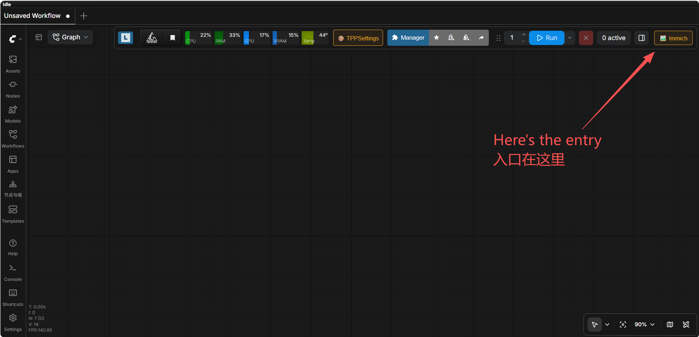
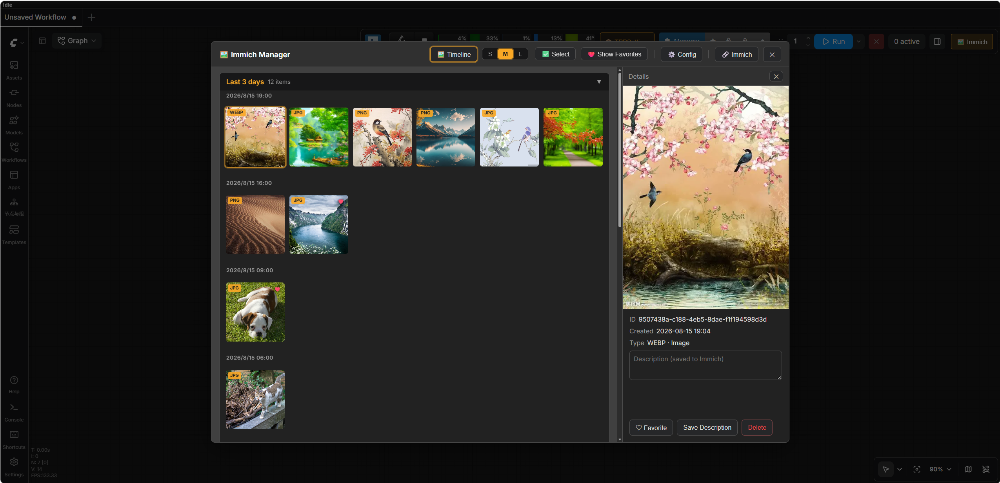
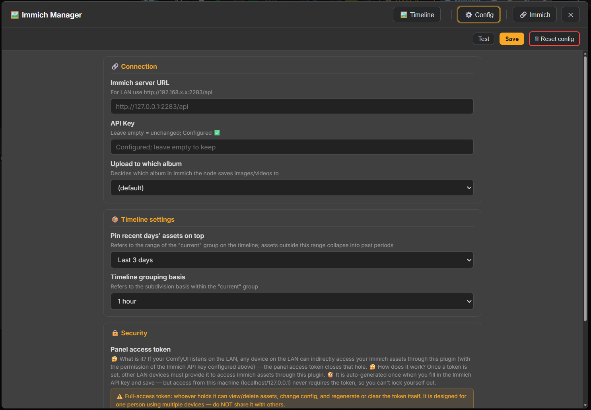
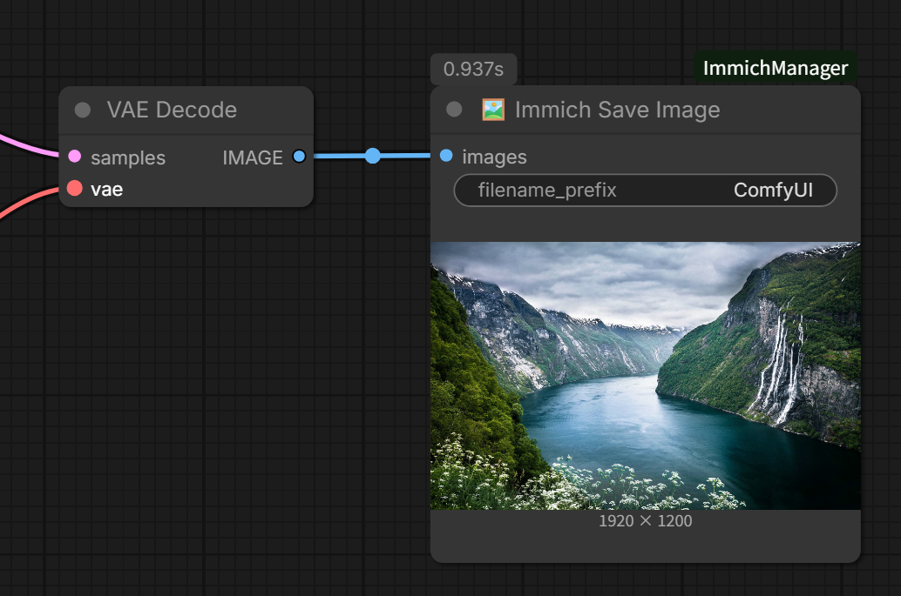
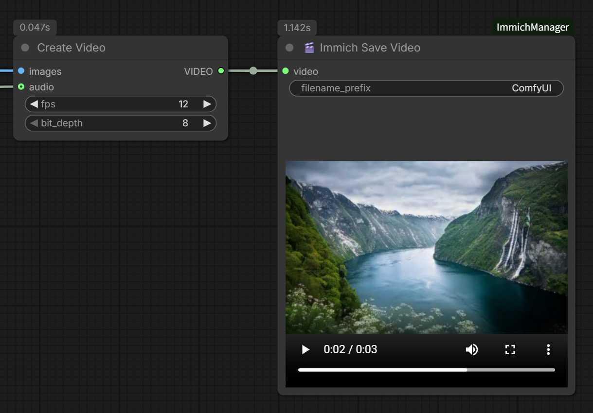

# ComfyUI-ImmichManager 🐾

> **⚠️ ARCHIVED** — This repository is the **development archive** of ComfyUI-ImmichManager. The project has moved to its public home: **[github.com/oitsukiii/ComfyUI-ImmichManager](https://github.com/oitsukiii/ComfyUI-ImmichManager)** (v1.0.0+). This archive is kept for historical reference (full git history, design docs, audit reports); no further development happens here.

**Upload ComfyUI-generated images/videos directly to your Immich library, with a built-in asset preview & management panel.**

[](./LICENSE)


> **English** | [简体中文](./README.zh-CN.md)

---

## Table of Contents

- [Features](#features)
- [Screenshots](#screenshots)
- [Installation](#installation)
- [Quick Start](#quick-start)
- [Usage](#usage)
- [Configuration](#configuration)
- [Security](#security)
- [FAQ](#faq)
- [Development](#development)
- [Contributing](#contributing)
- [License](#license)
- [Acknowledgements](#acknowledgements)

---

## Features

- **🖼️ `Immich Save Image` node** — upload generated images (PNG) with the current workflow embedded as metadata; drag the image back from Immich to restore the workflow.
- **🎬 `Immich Save Video` node** — accepts the official ComfyUI `VIDEO` type (`Create Video` / `Load Video` / …), encodes to MP4 (H.264) with workflow metadata, and shows an in-node video preview.
- **🗂️ Asset panel** — toolbar button opens a single-page panel: monthly timeline (foldable), lazy-loaded thumbnails, detail pane with favorite / delete / description, **selection mode with batch favorite / move-to-trash**, favorites-only filter, and per-session state persistence.
- **⚙️ Config page** — base URL, API key, panel token, default album, timeline grouping, language; saves instantly.
- **🌐 i18n** — English & Simplified Chinese; **follows your system language by default after install** (switchable in the config page, with an option to return to auto).
- **🎨 Theme-aware** — follows the ComfyUI light/dark theme (falls back gracefully to the original colors).

## Screenshots

1. **Entry point** — the Immich button in the ComfyUI toolbar (marked in the screenshot).



2. **Asset timeline page** — browse your library, lazy-loaded thumbnails, details & batch actions.



3. **Configuration page** — connection test, panel token, language settings.



## Installation

### 1. Option A: ComfyUI-Manager

Search for `ComfyUI-ImmichManager` in ComfyUI-Manager and install it, then restart ComfyUI.

### 2. Option B: Manual (git clone)

```bash
cd ComfyUI/custom_nodes
git clone https://github.com/oitsukiii/ComfyUI-ImmichManager.git ComfyUI-ImmichManager
```

Restart ComfyUI. The panel button appears in the top toolbar (🖼️ Immich).

### 3. Dependencies

| Package | Needed for | Note |
|---|---|---|
| `requests` | Immich REST client | Bundled with ComfyUI ≥ 0.30 |
| `pillow` | PNG encoding / metadata | Bundled with ComfyUI ≥ 0.30 |
| `aiohttp` | Panel backend (aiohttp routes) | Bundled with ComfyUI ≥ 0.30 |
| PyAV (`av`) | Video encoding via official `save_to` | Bundled with ComfyUI ≥ 0.30 |

**All dependencies ship with ComfyUI ≥ 0.30 — no extra install needed.** If your ComfyUI is older and the startup log shows `[ComfyUI-ImmichManager] dependencies missing ...`, run:

```bash
python -m pip install requests pillow aiohttp
```

and restart ComfyUI. The `[ComfyUI-ImmichManager]` log prefix always reports the dependency check result.

## Quick Start

1. Create an Immich API Key (Immich web → Administration → Settings → API Keys).
2. Restart ComfyUI, click **🖼️ Immich** in the toolbar → **⚙️ Configure**.
3. Fill in the Immich server URL (default `http://127.0.0.1:2283/api`; use `http://192.168.x.x:2283/api` for LAN) and the API key, then **Save**.
4. Click **Test Connection** to verify (shows the Immich version).
5. Browse assets in the timeline; add `🖼️ Immich Save Image` / `🎬 Immich Save Video` to your workflow to upload.

## Usage

Both nodes take their connection settings (base URL / API key / default album) from the panel config — no connection inputs on the node itself.

### 1. 🖼️ Immich Save Image

| Input | Type | Description |
|---|---|---|
| `images` | IMAGE (required) | ComfyUI image tensor; each image is uploaded individually |
| `filename_prefix` | STRING | Filename prefix for uploads (default `ComfyUI`) |

- Fixed **PNG** output: the current `prompt` / `workflow` JSON is written into the PNG metadata — download the image from Immich and **drag it back into ComfyUI to restore the workflow** (tested end-to-end).
- The node has **no image output** (`OUTPUT_NODE`, a pure upload/save node) — keep other nodes' outputs if you need to continue processing.
- A copy is kept in the ComfyUI temp folder for the node preview (ComfyUI **clears the `temp/` folder on every startup**; files stay during runtime for the frontend preview).
- **Upload filenames carry a millisecond timestamp** (`ComfyUI_1755300000000_0.png`), so they never collide with existing library names.
- **Content-level dedup is done by the Immich server**: each upload carries `x-immich-checksum` (SHA-1); if an asset with identical content already exists, the server returns `duplicate` and **does not create a duplicate file**.
- **Retry**: 3× exponential backoff (1s/2s) on network errors / 5xx / 429 / 408 only.
- Global concurrency cap of 3 (semaphore); album lookup / create / batch-add with a lock against concurrent duplicate creation.
- Upload failure raises and interrupts execution — **images already uploaded to Immich are neither rolled back nor re-uploaded**; the error lists each failed file and its reason.

Example wiring:



### 2. 🎬 Immich Save Video

| Input | Type | Description |
|---|---|---|
| `video` | VIDEO (required) | Official ComfyUI VIDEO type — from `Create Video` / `Load Video` / `Video Slice`, … |
| `filename_prefix` | STRING | Filename prefix (default `ComfyUI`) |

- **No image-sequence input**: for old workflows, insert the official `Create Video` node between your frames and this node.
- Uses the official `VideoInput.save_to()` (PyAV) to write MP4 (H.264) with container metadata:
  - From `Create Video` → PyAV H.264 encode (preserves bit depth, 8/10-bit).
  - From `Load Video` (source mp4 + H.264) → **pure copy, no re-encode** (fast, lossless, keeps the source audio track & tags).
  - Other sources → auto-transcoded to MP4 (H.264).
- **Workflow metadata**: `prompt` / `workflow` JSON written into the MP4 container (official `use_metadata_tags` mechanism) — download from Immich and drag back to restore the workflow (tested with PyAV read-back).
- **Audio support**: audio tracks from `Create Video` are preserved.
- **In-node video preview**: same mechanism as the official `Save Video` node (`ui.images` + `animated`).
- **Streaming upload**: files are uploaded in chunks (SHA-1 + multipart streaming) — large videos are never fully read into memory.
- A local `.mp4` is kept in the ComfyUI temp folder for the preview (it is also the upload source; ComfyUI **clears the `temp/` folder on every startup**).

Example wiring:



### 3. Asset panel

- Toolbar 🖼️ **Immich** button opens the panel: **timeline** (left) + **detail pane** (right, 340px fixed).
- Monthly buckets with "current period" (`timeline_range`) expanded and older periods collapsed.
- Hover a thumbnail to favorite it; the detail pane offers favorite, delete (→ Immich trash), and description editing.
- Three thumbnail zoom levels (small 64px / medium 112px / large 200px; remembered per session).
- **Selection mode**: click **✅ Select** in the header to enter; **shift + click** selects a range (starting from the last normally-clicked thumbnail) and auto-enters selection mode. The batch bar shows **Select all · Clear selection · ♡ Favorite · 🗑 Move to Trash · ✕ (exit)**.
  - When **all currently-visible assets are selected**, Favorite and Move to Trash ask for a second confirmation ("You selected ALL assets — continue?"); partial selections behave as before.
  - Deletes always go to the Immich trash.
- **Detail pane persistence**: whether the pane is open and the currently-selected asset are remembered per session — reopening the panel or switching views restores them; deleted / missing assets fall back to the placeholder page.
- **❤️ Show Favorites** filter: shows only assets favorited in Immich (un-favoriting hides them immediately).
- 🌐 **Open Immich** button jumps to the Immich web UI.

## Configuration

Stored in `<plugin>/config.json` — **auto-generated on first save**, not part of the repo and **git-ignored** (your API key will never be committed to a public repository); file permissions are `0o600` (owner read/write only). Never commit or share it.

The config page has a **🗑 Reset config** button (with confirmation) that clears the Immich URL, API key and panel token in one click, restoring the fresh-install defaults.

| Field | Description |
|---|---|
| `base_url` | Immich API URL. **http/https only** (SSRF checks: rejects IP-obfuscation / link-local / reserved ranges / redirects — see Security). |
| `api_key` | Immich API key. **Stored only in the backend config.json; never sent to the browser** — the frontend only sees `api_key_configured: true/false`. |
| `panel_token` | Panel access token. When set, every `/api/immich_plus/*` request must send `Authorization: Bearer <token>`. **Auto-generated when you save the connection config**; the 🔒 Security group in the config page lets you **show / regenerate / clear** it. |
| `default_album` | Default album for upload nodes (nodes have no album input; configured here). |
| `timeline_range` | "Current period" of the timeline: `today` / `3d` / `7d` (default `today`); older assets collapse into past periods. |
| `timeline_interval` | Grouping interval inside the current period: `15m` / `30m` / `1h` / `1d` (default `1h`). |
| `page_size` | Pagination size (min 1, max 1000). |

## Security

This section starts from the **panel access token** you actually see in the 🔒 Security group of the config page, and explains it step by step.

### 1. What is the panel access token?

Open the plugin config page — at the bottom is the 🔒 **Security** group with the **panel access token**:

- It is **auto-generated when you save the connection config**; normally you don't have to think about it;
- The Security group has **Show / Regenerate / Clear** buttons so you can view or rotate it anytime.

It is the **key to the panel**: once set, other devices on your LAN must enter this key before they can open the panel; otherwise requests are rejected (401).

### 2. Why is it needed?

ComfyUI itself has no server-level access key (verified on 0.30.0) — anyone who can reach your ComfyUI page can operate the panel. Your Immich API key is hidden in the backend `config.json`, but **if the panel itself is open, anyone who can reach your machine or LAN can control your Immich**.

So this plugin ships minimal built-in auth: once the panel access token is set, every panel request must carry it, or it gets a 401.

> ⚠️ **No token = trust mode**: in that state, anyone who can reach your ComfyUI port can read/write your Immich library. For local-only use, run ComfyUI with `--listen 127.0.0.1`; if you need LAN access, make sure a token is set.

### 3. Your machine (the one running ComfyUI) never enters the token

The panel is **always trusted on localhost / 127.0.0.1** — even if you regenerate or clear the token, the machine running ComfyUI can always get back in, so you can never lock yourself out. Other devices still need the token.

> The check uses the real network source of the connection and **does not trust the spoofable `X-Forwarded-For` header**.

### 4. How do other (LAN) devices access the panel?

A LAN device opens the panel → is asked for the token → after entering it:

- **Default**: the token is kept only in the **current browser tab** (sessionStorage) and is cleared when the tab or browser closes — enter it again next time;
- **Optional**: check **"☑ Remember token on this device"** to store it in the browser's localStorage, which survives browser restarts — no re-entry next time.

> ⚠️ Before checking "Remember", read the UI warning: **any same-origin script (including other custom nodes' JS) can read localStorage**. Only check it in a browser you trust.

### 5. Where is the token stored?

- **Backend**: the plaintext lives only in the plugin's `config.json` (file permission `0o600`, owner read/write only) and is **never sent back to the browser** — the frontend only sees "configured / not configured", never the token itself;
- **Browser**: only a **copy** of what you entered (or revealed in the Security group) is kept — sessionStorage by default, localStorage when "Remember" is checked (step 4).

### 6. Important: this is a "full-access key"

Whoever holds the token can: view/delete your Immich assets, change the plugin config, and even regenerate or clear the token itself.

- It is designed for **one person across their own devices — do not share it**;
- Any same-origin script that can run JS can read the token in the browser — keep the ComfyUI page free of XSS (don't install unknown custom nodes).

### 7. Technical details (read when troubleshooting)

- **Connection URL validation**: `base_url` accepts http/https only; rejects userinfo, IP-obfuscated literals, link-local/reserved addresses, and never follows redirects (anti-SSRF). Private ranges (e.g. 192.168.x.x) are allowed **by design** for LAN usage — **whoever can configure the URL is trusted**, so set a token and bind ComfyUI to a trusted network.
- **Image/video loading**: fetch + blob (Authorization header); the token **never appears in URL query parameters or access logs**.
- **Delete safety**: deletes always go to the Immich trash and can be restored from the Immich web UI.
- **Logging**: never enable DEBUG logging for `requests` while debugging (it logs request headers including the API key). Use INFO or read the `[ComfyUI-ImmichManager]` prefixed lines.

## FAQ

**Q: The panel is slow / takes long on first open?**
A: The first open pulls the full metadata set per time bucket (lightweight fields; ~100 paginated requests for 100k assets) to build the timeline grouping and format badges; cached for 60s afterwards. Large libraries are slower on first open — expected.

**Q: Video preview stutters / very large videos won't play?**
A: The panel downloads the video into browser memory (fetch + blob) before playing — the security cost of keeping the token out of URLs. For very large videos, use the 🌐 **Open Immich** button and play in the Immich web UI.

**Q: Can uploaded images/videos be dragged back to restore the workflow?**
A: Yes. Images (PNG) and videos (MP4) carry the current `prompt` / `workflow` metadata; download from Immich and drag into the ComfyUI canvas (tested).

**Q: Can deleted assets be recovered?**
A: Deletes always go to the Immich trash (tested on v2.x); restore from the Immich web UI. The plugin does not offer "empty trash".

## Development

```bash
# Unit / route tests (test_client.py needs a real Immich + a test key)
python3 tests/test_config.py
python3 tests/test_routes.py
python3 tests/test_upload_node.py
python3 tests/test_extract.py
python3 tests/test_client_bulk_offline.py
IMMICH_TEST_KEY=xxx python3 tests/test_client.py
```

Architecture & API contract: `docs/PLAN.md` (historical design document — this README is authoritative).

## Contributing

Issues and pull requests are welcome. For feature requests or bug reports, please open a GitHub issue with:
- ComfyUI version & platform
- Immich version
- Steps to reproduce + the `[ComfyUI-ImmichManager]` log lines

Please follow the existing code style (Chinese comments in code, module docstrings) and run the offline tests before submitting.

## License

[MIT](./LICENSE) © 2026 ComfyUI-ImmichManager Contributors

## Acknowledgements

- Built with the assistance of **DeepSeek V4 Flash** and **DeepSeek V4 Pro** for design, implementation and code review.
- Thanks to [ComfyUI](https://github.com/comfyanonymous/ComfyUI) for its rich node ecosystem and stable extension mechanism, which make custom node development a pleasure.
- Thanks to [Immich](https://github.com/immich-app/immich) for its comprehensive REST API — the album, timeline, trash and other capabilities of this plugin are built on its excellent design.
