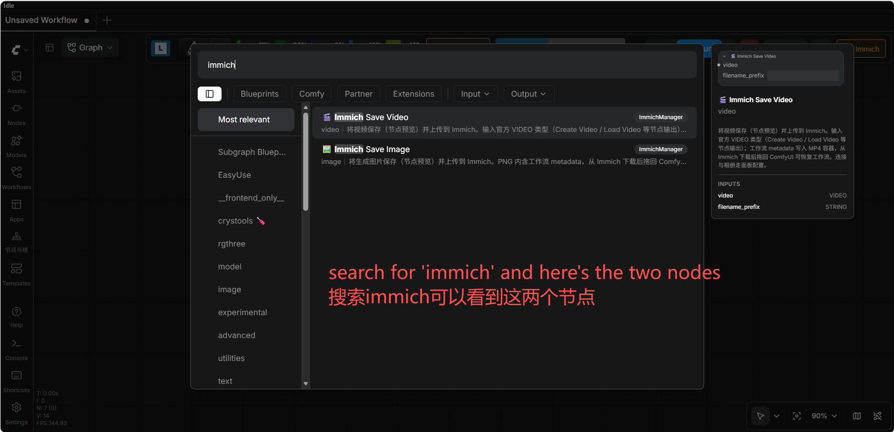

# ComfyUI-ImmichManager 🐾

> **⚠️ 已归档** — 本仓库是 ComfyUI-ImmichManager 的**开发期归档**。项目已迁移至公开仓库：**[github.com/oitsukiii/ComfyUI-ImmichManager](https://github.com/oitsukiii/ComfyUI-ImmichManager)**（v1.0.0+）。此处保留完整 git 历史、设计文档与审查报告，仅作历史备查，不再继续开发。

**把 ComfyUI 生成的图片/视频直接上传到你的 Immich 相册，内置资产预览与管理面板。**

[](./LICENSE)


> [English](./README.md) | **简体中文**

---

## 目录

- [功能特性](#功能特性)
- [截图](#截图)
- [安装](#安装)
- [快速开始](#快速开始)
- [使用说明](#使用说明)
- [配置项](#配置项)
- [安全模型](#安全模型)
- [FAQ](#faq)
- [开发](#开发)
- [贡献](#贡献)
- [许可证](#许可证)
- [致谢](#致谢)

---

## 功能特性

- **🖼️ `Immich Save Image` 上传节点** — 生成图（PNG）带当前工作流 metadata 上传；从 Immich 下载后拖回画布即可恢复工作流。
- **🎬 `Immich Save Video` 上传节点** — 接受官方 ComfyUI `VIDEO` 类型（`Create Video` / `Load Video` 等），编码为 MP4（H.264）+ 工作流 metadata，节点自带视频预览。
- **🗂️ 资产面板** — 工具栏按钮打开单页面板：月粒度时间轴（可折叠）+ 缩略图懒加载 + 详情栏（收藏/删除/描述），**支持选择模式批量收藏 / 移到回收站**、只看收藏过滤、会话状态持久化。
- **⚙️ 配置页** — 连接地址 / API Key / 面板令牌 / 默认相册 / 时间轴分组 / 语言，保存即时生效。
- **🌐 多语言** — 英文与简体中文，**安装后默认跟随系统语言**（配置页可切换，也可恢复自动跟随）。
- **🎨 主题适配** — 跟随 ComfyUI 亮/暗主题（找不到主题变量时优雅回退到原色）。

## 截图

1. **入口按钮位置** — ComfyUI 工具栏上的 Immich 按钮入口（图中已标注）。


2. **资产时间线页面** — 浏览图库，缩略图懒加载、详情与批量操作。


3. **配置详情页面** — 连接测试、面板令牌、语言设置。


4. **查找节点** — 在新建节点菜单搜索 "immich" 即可看到两个节点。



## 安装

### 1. 方式 A：ComfyUI-Manager

在 ComfyUI-Manager 中搜索 `ComfyUI-ImmichManager` 安装，然后重启 ComfyUI。

### 2. 方式 B：手动（git clone）

```bash
cd ComfyUI/custom_nodes
git clone https://github.com/oitsukiii/ComfyUI-ImmichManager.git ComfyUI-ImmichManager
```

重启 ComfyUI。顶部工具栏出现面板按钮（🖼️ Immich）。

### 3. 依赖

| 包 | 用途 | 说明 |
|---|---|---|
| `requests` | Immich REST 客户端 | ComfyUI ≥ 0.30 自带 |
| `pillow` | PNG 编码 / metadata | ComfyUI ≥ 0.30 自带 |
| `aiohttp` | 面板后端（aiohttp 路由） | ComfyUI ≥ 0.30 自带 |
| PyAV (`av`) | 视频编码（官方 `save_to`） | ComfyUI ≥ 0.30 自带 |

**全部依赖随 ComfyUI ≥ 0.30 自带，无需额外安装。** 若你的 ComfyUI 版本较旧，启动日志出现
`[ComfyUI-ImmichManager] dependencies missing ...`，请执行：

```bash
python -m pip install requests pillow aiohttp
```

然后重启 ComfyUI。`[ComfyUI-ImmichManager]` 日志前缀会明确报告依赖检查结果。

## 快速开始

1. 在 Immich 创建 API Key（Immich 网页 → 右上角头像 → 账号设置 → API密钥）。
2. 安装好本插件后重启 ComfyUI，点击工具栏 **🖼️ Immich** → **⚙️ 配置**。
3. 填写 Immich 服务地址（默认 `http://127.0.0.1:2283/api`；局域网填 `http://192.168.x.x:2283/api`）和 API Key，点 **保存**。
4. 点 **测试连接** 确认连通（可选操作，显示 Immich 版本号）。
5. 在时间轴浏览并管理 Immich 资产。
6. 在工作流里添加 `🖼️ Immich Save Image` / `🎬 Immich Save Video` 节点即可上传。

## 使用说明

两个上传节点的连接配置（地址 / API Key / 默认相册）统一走面板配置，节点上不再有连接类输入。

### 1. 🖼️ Immich Save Image

| 输入 | 类型 | 说明 |
|---|---|---|
| `images` | IMAGE（必填） | ComfyUI 图像张量，逐张上传 |
| `filename_prefix` | STRING | 上传文件名前缀（默认 `ComfyUI`） |

- 上传格式：固定为 PNG 上传（保证工作流 metadata 可写回）。
- 隐私提醒：当前`prompt` / `workflow` JSON 一并写入 PNG metadata；从 Immich 下载后**拖回 ComfyUI 画布即可恢复工作流**（已端到端实测）。
- 节点**没有图像输出**（`OUTPUT_NODE` 纯上传/保存节点）——需要继续处理图像请保留上游节点输出。
- 本地 temp 目录保存一份用于节点预览（ComfyUI **每次启动时清空 `temp/` 目录**；运行期间文件保留，供前端展示）。
- **上传文件名自带毫秒时间戳**（`ComfyUI_1755300000000_0.png`），天然避免与库内资产重名。
- **内容去重交给 Immich 服务端**：上传时携带 `x-immich-checksum`（SHA-1），若 Immich 中已有相同内容的资产，服务端返回 `duplicate` 且**不新建重复文件**。
- **重试**：3 次指数退避（1s/2s），仅网络错误 / 5xx / 429 / 408。
- 全局并发上限 3（信号量）；相册按名查找 / 创建 / 批量加入（带锁防并发建同名）。
- 某张上传失败时抛错中断执行——**已成功上传进 Immich 的图不会回滚也不会重传**，错误信息会列出每个失败文件及原因。

用法示例：


### 2. 🎬 Immich Save Video

| 输入                | 类型        | 说明                                                             |
| ----------------- | --------- | -------------------------------------------------------------- |
| `video`           | VIDEO（必填） | 官方 VIDEO 类型，来自 `Create Video` / `Load Video` / `Video Slice` 等 |
| `filename_prefix` | STRING    | 文件名前缀（默认 `ComfyUI`）                                            |

- **不接受图片序列**：输入类型为 `video` ，帧序列 `image` 与本节点之间插入官方 `Create Video` 节点。
- 使用官方 `VideoInput.save_to()`（PyAV）落盘 MP4（H.264）+ 容器 metadata：
  - `Create Video` 输出 → PyAV H.264 编码（保持创建位深，8/10-bit）；
  - `Load Video` 引用（源 mp4 + H.264）→ **纯 copy 不重编码**（快、无损、保留音轨与标签）；
  - 其他来源 → 自动转码为 MP4（H.264）。
- 隐私提醒：当前`prompt` / `workflow` JSON 一并写入 MP4 容器（官方 `use_metadata_tags` 机制），下载后拖回可恢复工作流（已用 PyAV 读回实测）。
- **支持音频**：`Create Video` 带 audio 时音轨随视频保留。
- **节点视频预览**：与官方 `Save Video` 同机制（`ui.images` + `animated`）。
- **流式上传**：分块 SHA-1 + multipart 流式上传——大视频不会整读进内存。
- 本地 temp 保存 `.mp4` 用于节点预览（同时作为上传源文件；ComfyUI **每次启动时清空 `temp/` 目录**）。

用法示例：


### 3. 资产面板

- 从工具栏 🖼️ **Immich** 按钮打开面板：**时间轴**（左）+ **详情栏**（右，固定 340px）。
- 月粒度分桶，本期（`timeline_range`）默认展开、往期折叠。
- 缩略图悬停可收藏；详情栏支持收藏、删除（→ Immich 回收站）、编辑描述。
- 三挡缩略图缩放（小 64px / 中 112px / 大 200px；sessionStorage 记忆）。
- **选择模式**：点顶部「✅ 选择」进入；**shift + 点选**按范围选择（从最近一次普通点击的缩略图开始）并自动进入选择模式。批量操作栏提供「全选 · 取消选择 · ♡ 收藏 · 🗑 移到回收站 · ✕（退出）」。
  - 当**选中了当前时间轴全部可见资产**时，收藏与移到回收站会弹出二次确认（「当前选中了所有资产，是否继续操作」）；非全选时保持原行为。
  - 删除一律进 Immich 回收站。
- **详情栏持久化**：详情栏开关状态与当前选中资产按会话记忆——重开面板或切换视图自动还原；资产被删除/找不到时回退到占位页。
- **❤️ 只看收藏**过滤：仅显示 Immich 中已收藏的资产（取消收藏后立即从列表消失）。
- 🔗 **打开 Immich** 按钮跳转 Immich 网页。

## 配置项

配置保存在插件目录下的 `config.json`——**首次保存配置时自动生成**，不在仓库里、已被 `.gitignore` 排除（你的 API Key 绝不会被 `git` 提交进公开仓库）；文件权限 `0o600`（仅属主可读写）。请勿手动把它提交或分享。

配置页顶部提供 **🗑 清空配置** 按钮（带二次确认）：一键清空 Immich 地址 / API Key / 面板令牌，恢复为刚安装时的出厂状态。

| 字段                  | 说明                                                                                     |
| ------------------- | -------------------------------------------------------------------------------------- |
| `base_url`          | Immich API 地址。**仅支持 http/https**（SSRF 校验：拒绝 IP 混淆 / link-local / 保留段 / 重定向——见安全模型）。    |
| `api_key`           | Immich API Key。**只保存在后端 config.json，绝不下发浏览器**——前端只看到 `api_key_configured: true/false`。 |
| `panel_token`       | 面板访问令牌。设置后所有 `/api/immich_plus/*` 请求必须带 `Authorization: Bearer <token>`。**保存连接配置时自动生成**；配置页 🔒 安全分组可**显示 / 重新生成 / 清除**。 |
| `default_album`     | 上传节点默认加入的相册名（节点无相册输入，统一走这里）。                                                           |
| `timeline_range`    | 时间轴"本期"大组范围：`today` / `3d` / `7d`（默认 `today`）；更早资产归入往期折叠。                              |
| `timeline_interval` | 本期大组内的小组间隔：`15m` / `30m` / `1h` / `1d`（默认 `1h`）。                                       |
| `page_size`         | 分页大小（下界 1，上限 1000）。                                                                    |

## 安全模型

下面从你在**配置页 🔒 安全分组**里实际看到的面板访问令牌讲起，按使用顺序说明。

### 1. 面板访问令牌是什么？

打开插件配置页，底部是 🔒 **安全**分组，里面有**面板访问令牌**：

- 保存连接配置时**自动生成**，平时不需要你操心；
- 安全分组里有 **显示** / **重新生成** / **清除** 三个按钮，可随时查看或更换。

它是一把**访问面板的钥匙**：设置后，局域网里的其他设备打开面板必须先输入这把钥匙，否则请求被拒绝（401）。

### 2. 为什么需要它？

ComfyUI 本身没有服务器级访问密钥（0.30.0 实测），任何人只要能打开你的 ComfyUI 页面，就能操作面板。你的 Immich API Key 虽然藏在后端 config.json，但**面板本身不设防的话，能碰到你电脑或局域网的人就能操控你的 Immich**。

所以插件自带最小鉴权：配置了面板访问令牌后，所有面板请求必须携带令牌，否则 401。

> ⚠️ **未设置令牌 = 信任模式**：此时任何能访问你 ComfyUI 端口的人都能读写你的 Immich。如果只在本地使用，建议 ComfyUI 用 `--listen 127.0.0.1` 只监听本机；要局域网访问，务必设置令牌。

### 3. 你本机（跑 ComfyUI 的电脑）不用输入令牌

面板在**本机**（localhost / 127.0.0.1）永远免令牌——即使你重新生成或清除令牌，本机也随时能打开面板，不会把自己锁在外面。其他设备仍须输入令牌。

> 判定只看网络连接的真实来源，**不信任可伪造的 `X-Forwarded-For` 头**。

### 4. 其他设备（局域网）怎么访问？

局域网设备打开面板 → 提示输入令牌 → 输入后：

- **默认**：令牌只保存在**当前浏览器标签页**（sessionStorage），关闭标签页或浏览器后失效，下次再输一次；
- **可选**：勾选「☑ 记住令牌到本机」→ 保存到本机浏览器 localStorage，重启浏览器也有效，下次免输入。

> ⚠️ 勾选"记住"前请看清界面提示：**任何同源脚本（包括其他自定义节点的 JS）都能读取 localStorage 里的令牌**。只在你自己信任的浏览器上勾选。

### 5. 令牌存在哪里？

- **后端**：明文只存在插件的 `config.json`（文件权限 `0o600`，仅属主可读写），**绝不会回传浏览器**——前端只能看到「已配置/未配置」，看不到令牌本身；
- **浏览器**：只存你在第 4 步输入（或安全分组里显示）过的**副本**，默认在 sessionStorage，勾选"记住"后在 localStorage。

### 6. 重要：这是一把"全权限钥匙"

持有令牌的人可以：查看/删除你的 Immich 资产、修改插件配置、甚至重新生成或清除令牌本身。

- 它面向**一个人在多台自己的设备之间使用**的情形，**请勿分发给他人**；
- 任何能执行脚本的同源页面都能读到浏览器里的令牌——请保持 ComfyUI 页面不受 XSS 攻击（不要安装来路不明的自定义节点）。

### 7. 技术细节（排查问题时再读）

- **连接地址校验**：`base_url` 只允许 http/https，拒绝用户名密码、混淆 IP、链路本地/保留地址，且禁止跟随重定向（防 SSRF）。允许内网地址（如 192.168.x.x）是局域网场景的刻意设计——**能配置地址的人默认可信**，所以请务必设置令牌，并把 ComfyUI 监听在可信网络。
- **图片/视频加载**：走 fetch + blob（Authorization header），令牌**不会**出现在 URL 查询参数或访问日志里。
- **删除安全**：删除操作总是进 Immich 回收站，可在 Immich 网页恢复。
- **日志**：调试时不要开 requests DEBUG 日志（会记录含 API Key 的请求头），请用 INFO 级别或看 `[ComfyUI-ImmichManager]` 前缀行。

## FAQ

**Q：面板打开很慢 / 首次打开加载很久？**
A：首次打开会按时间桶**全量拉取一遍资产元数据**（轻量字段，10 万资产约 100 次分页请求）用于构建时间轴分组与格式角标，之后 60s 内走缓存。资产规模大时首次打开会慢一些，属预期行为。

**Q：视频预览卡顿 / 超大视频打不开？**
A：面板内视频用 fetch + blob 先整段下载到浏览器内存再播放（令牌不进 URL 的安全代价）。超大视频建议点「🌐 打开 Immich」在 Immich 网页里播放。

**Q：上传的图片/视频能拖回 ComfyUI 恢复工作流吗？**
A：可以。图片（PNG）与视频（MP4）都写入了当前工作流的 `prompt` / `workflow` metadata，从 Immich 下载后拖回 ComfyUI 画布即可恢复。

**Q：删除的资产还能找回吗？**
A：删除操作总是进 Immich 回收站，可在 Immich 网页恢复。插件未提供「清空回收站」功能。

## 开发

```bash
# 单元 / 路由测试（test_client.py 需真实 Immich + 测试 key）
python3 tests/test_config.py
python3 tests/test_routes.py
python3 tests/test_upload_node.py
python3 tests/test_extract.py
python3 tests/test_client_bulk_offline.py
IMMICH_TEST_KEY=xxx python3 tests/test_client.py
```

架构与 API 契约见 `docs/PLAN.md`（历史设计文档——以本 README 为准）。

## 贡献

欢迎提交 Issue 与 Pull Request。提交 bug 或功能请求时请附：
- ComfyUI 版本与平台
- Immich 版本
- 复现步骤 + `[ComfyUI-ImmichManager]` 日志行

请保持现有代码风格（代码内中文注释、模块 docstring），提交前跑一遍离线测试。

## 许可证

[MIT](./LICENSE) © 2026 ComfyUI-ImmichManager Contributors

## 致谢

- 本项目采用 **vibe coding** 方式开发——由 **DeepSeek V4 Flash** 与 **DeepSeek V4 Pro** 辅助完成设计、实现与代码审查。
- 感谢 [ComfyUI](https://github.com/comfyanonymous/ComfyUI) 官方提供的丰富节点生态与稳定的扩展机制，让自定义节点开发如此顺畅。
- 感谢 [Immich](https://github.com/immich-app/immich) 官方提供功能全面的 REST API，本插件的相册、时间轴、回收站等能力都建立在它的优秀设计之上。
